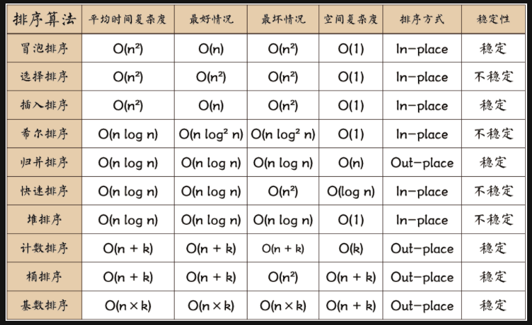

# Sort 总结



```c++

class Solution {
public:
    void quickSort(vector<int>& nums, int l, int r) {
        if(l >= r)
            return;
        int k = l;

        int i = l, j = r;

        while(i < j) {
            while(i < j && nums[k] <= nums[j]) --j;
            swap(nums[k], nums[j]);
            k = j;
            while(i < j && nums[i] < nums[k]) ++i;
            swap(nums[k], nums[i]);
            k = i;
        }

        quickSort(nums, l, k - 1);
        quickSort(nums, k + 1, r);
    }

    void adjustHeap(vector<int>& nums, int i, int size) {
        int origin = i;
        int greater = i;
        // 完全二叉树的左节点 2 * i + 1 右节点 2 * i + 2
        int l = 2 * i + 1;
        int r = 2 * i + 2;
        if(l < size && nums[l] > nums[i]) {
            greater = l;
        }
        if(r < size && nums[r] > nums[i] && nums[r] > nums[l]) {
            greater = r;
        }

        if(greater != origin) {
            swap(nums[i], nums[greater]);
            // 调整完以后， 堆可能会变
            adjustHeap(nums, greater, size);
        }
    }


    void heapSort(vector<int>& nums) {
        // 完全二叉树的数组表示
        /*
            假设当前节点是第 n 层的节点且是该层的第 x 个，标号为 i，其左孩子是第 n+1 层的节点，标号为 j。
            2^(n-1) - 1 + x = i
            2^(n) - 1 + 2x = j
            得 j = 2 * i + 1
        */

        //分两步，第一步创建堆，第二步不断交换元素
        //注意 adjustHeap 中， 需要第三个参数给出边界，避免总是调节。
        for(int i = nums.size()/2 - 1; i >= 0; --i) { // 从最后一个非叶子节点还是调整，一因为只有非叶子节点才会出现违背堆定义的情况。
            adjustHeap(nums, i, nums.size());
        }

        for(int i = nums.size() - 1; i > 0; --i) {
            swap(nums[0], nums[i]);
            adjustHeap(nums, 0, i);
        }
    }

    vector<int> sortArray(vector<int>& nums) {
        // quickSort(nums, 0, nums.size() - 1);
        heapSort(nums);
        return nums;
    }
};

```
